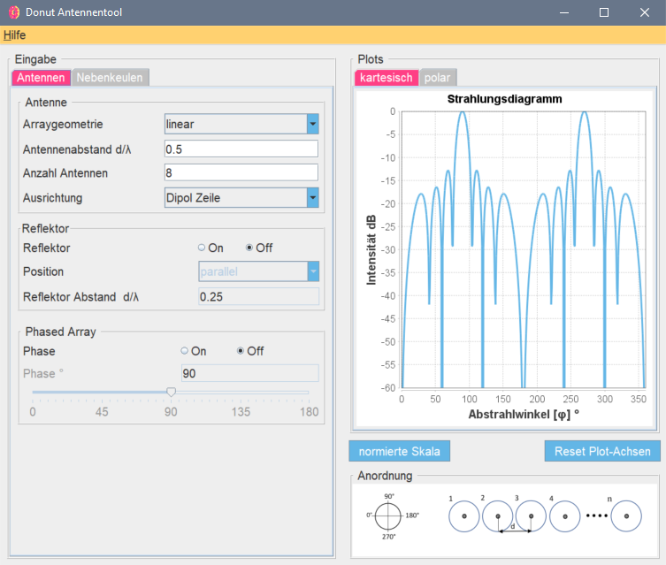
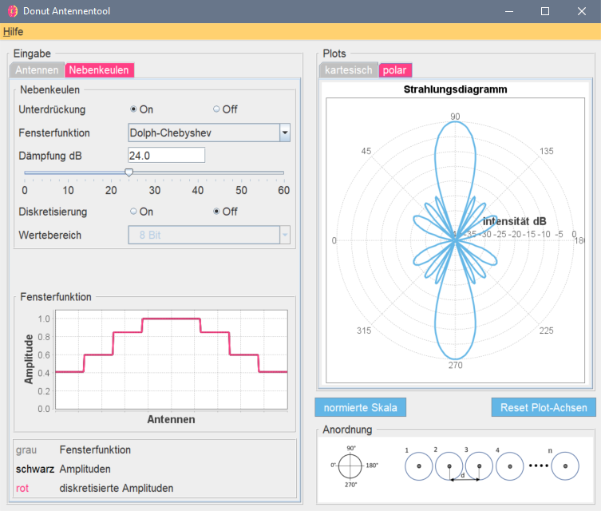

# Donut

Antennatool to visualy learn about phased array antennas antenna plots.

---

## Purpose

This is a graphical tool to visualize linear antenna array diagramms. It is meant to be a toy to play around with different parameters and explore the topic of antenna arrays.

[kaon.ch/donut](https://kaon.ch/donut)

## What it can do

__visualize linear antenna arrays__

- number of antennas 1 - 100
- variable distance between antennas
- 3 different antenna types (isotropic, dipole)
- reflector broadside and endfire
- linear phased array
- sidelobe suppression using various window functions (Chebyshev, binomial, cosine)

__visualize circular antenna arrays__

- number of antennas 1 - 100
- variable radius

---

## User interface




---

### Setting up the project

#### External Classes (Libraries)

```
<classpathentry kind="lib" path=".../libraries/apache-commons/commons-math3-3.6.1/commons-math3-3.6.1.jar"/>
<classpathentry kind="lib" path=".../libraries/jfreechart-1.0.19/lib/jfreechart-1.0.19.jar"/>
<classpathentry kind="lib" path=".../libraries/jfreechart-1.0.19/lib/jcommon-1.0.23.jar"/>
```

The tutorial feature uses a JavaFX Brower to display html pages. Under Eclipse, set the following rules to access the JavaFX libraries:

`Project Properties > Java Build Path > JRE System Library > Access rules > Add`

```
Accessible javafx/**
Accessible con/sun/javafx/application/**
```

---

## About

This was a project (P2E) at the university of applied sciences northwestern Switzerland (FHNW) for the major in electronical engineering.

__Project Lead__

- Dagelet Patrice

__Software__

- Burkhardt Simon
- Stadlin Christian

__Mathematics__

- Enderlin Stefan
- Studer Mischa
- Frey Fabian
- Läderach Reto

---

©2018 Fachhochschule Nordwestschweiz Hochschule für Technik - P2E FS18 Team 1

Licenesed under MIT License


